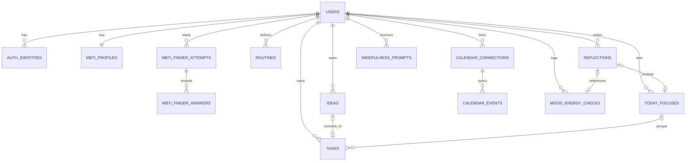

# DB 스키마 초안

마지막 업데이트: 2026-03-24

기준 문서:

- [agent.md](/Users/admin/IdeaProjects/mbti-self-cdm/agent.md)
- [mvp-screen-spec.md](/Users/admin/IdeaProjects/mbti-self-cdm/docs/mvp-screen-spec.md)
- [technical-stack-decision.md](/Users/admin/IdeaProjects/mbti-self-cdm/docs/technical-stack-decision.md)

## 1. 범위와 전제

- 이 문서는 특정 벤더 확정 전 단계의 논리 스키마 초안이다
- 영속 데이터는 관계형 DB를 기준으로 설계한다
- `JWT/session` 상태는 관계형 DB가 아니라 Redis에서 관리한다
- 캘린더 연동은 백엔드가 소유하며, 외부 이벤트를 내부 `CalendarEvent`로 정규화한다
- `Task`와 `Idea`는 별도 테이블로 유지한다
- 사용자별 활성 MBTI profile은 하나만 둔다
- 유형별 UX 차이를 만드는 master data는 이후 `type-profile JSON`로 분리한다

## 2. 저장소 분리 원칙

관계형 DB에 저장하는 것:

- 사용자 계정 및 연결된 인증 식별자
- MBTI profile과 type finder 이력
- Task / Idea / TodayFocus / Routine
- 캘린더 연결 메타데이터와 정규화된 이벤트
- mood/energy check, reflection, mindfulness prompt

Redis에 저장하는 것:

- refresh token family
- access token revocation / session lookup
- OAuth `state` / `nonce`
- 캘린더 sync lock

관계형 DB에 직접 저장하지 않는 것:

- access JWT 원문
- 장기 세션 캐시

## 3. 관계 요약

## 4. 핵심 enum 초안

- `auth_provider`: `KAKAO`, `GOOGLE`, `APPLE`, `NAVER`
- `onboarding_status`: `AUTH_ONLY`, `MBTI_PENDING`, `CALENDAR_PENDING`, `COMPLETED`
- `mbti_source`: `SELF_SELECTED`, `FINDER_RESULT`, `MANUAL_CHANGE`
- `finder_attempt_status`: `IN_PROGRESS`, `COMPLETED`, `ABANDONED`
- `task_status`: `INBOX`, `PLANNED`, `IN_PROGRESS`, `DONE`, `ARCHIVED`
- `idea_status`: `ACTIVE`, `ARCHIVED`, `CONVERTED`
- `today_focus_status`: `ACTIVE`, `COMPLETED`, `SKIPPED`
- `routine_cadence_type`: `DAILY`, `WEEKLY`, `CUSTOM`
- `calendar_provider`: `GOOGLE`, `APPLE`, `OTHER`
- `calendar_connection_status`: `ACTIVE`, `SYNCING`, `ERROR`, `REVOKED`
- `calendar_event_status`: `CONFIRMED`, `TENTATIVE`, `CANCELLED`
- `check_context`: `MORNING`, `EVENING`, `ADHOC`

## 5. 테이블 초안

### 5.1 `users`

| 컬럼 | 타입 | NULL | 제약 / 설명 |
| --- | --- | --- | --- |
| `id` | `uuid` | N | PK |
| `display_name` | `varchar(100)` | Y | 사용자 표시명 |
| `primary_email` | `varchar(255)` | Y | 대표 이메일 |
| `locale` | `varchar(16)` | N | 기본값 `ko-KR` |
| `timezone` | `varchar(64)` | N | 기본값 `Asia/Seoul` |
| `onboarding_status` | `varchar(32)` | N | onboarding 상태 |
| `notification_prefs_json` | `json` | Y | 알림 설정 |
| `last_active_at` | `timestamp with time zone` | Y | 최근 활성 시각 |
| `created_at` | `timestamp with time zone` | N | 생성 시각 |
| `updated_at` | `timestamp with time zone` | N | 수정 시각 |

인덱스:

- `idx_users_onboarding_status (onboarding_status)`

### 5.2 `auth_identities`

| 컬럼 | 타입 | NULL | 제약 / 설명 |
| --- | --- | --- | --- |
| `id` | `uuid` | N | PK |
| `user_id` | `uuid` | N | FK -> `users.id` |
| `provider` | `varchar(16)` | N | `auth_provider` |
| `provider_user_id` | `varchar(255)` | N | provider 내부 사용자 식별자 |
| `provider_email` | `varchar(255)` | Y | provider 제공 이메일 |
| `provider_display_name` | `varchar(255)` | Y | provider 제공 이름 |
| `raw_profile_json` | `json` | Y | 원본 프로필 스냅샷 |
| `linked_at` | `timestamp with time zone` | N | 연결 시각 |
| `last_login_at` | `timestamp with time zone` | Y | 최근 로그인 |

제약 / 인덱스:

- `unique(provider, provider_user_id)`
- `idx_auth_identities_user_id (user_id)`

### 5.3 `mbti_profiles`

| 컬럼 | 타입 | NULL | 제약 / 설명 |
| --- | --- | --- | --- |
| `id` | `uuid` | N | PK |
| `user_id` | `uuid` | N | FK -> `users.id`, unique |
| `type_code` | `char(4)` | N | 예: `INFJ` |
| `source` | `varchar(32)` | N | `mbti_source` |
| `is_user_confirmed` | `boolean` | N | best-fit confirmation 여부 |
| `confidence_score` | `decimal(5,4)` | Y | finder 결과 confidence |
| `finder_version` | `varchar(32)` | Y | 질문 세트 버전 |
| `profile_version` | `varchar(32)` | Y | 적용된 type-profile pack 버전 |
| `last_changed_at` | `timestamp with time zone` | N | 최근 변경 시각 |
| `created_at` | `timestamp with time zone` | N | 생성 시각 |
| `updated_at` | `timestamp with time zone` | N | 수정 시각 |

노트:

- `home_mode`, `planning_style`, `reminder_tone` 같은 master data는 여기 중복 저장하지 않고, 이후 `type-profile JSON`에서 관리한다.

### 5.4 `mbti_finder_attempts`

| 컬럼 | 타입 | NULL | 제약 / 설명 |
| --- | --- | --- | --- |
| `id` | `uuid` | N | PK |
| `user_id` | `uuid` | N | FK -> `users.id` |
| `status` | `varchar(32)` | N | `finder_attempt_status` |
| `question_set_version` | `varchar(32)` | N | 질문 세트 버전 |
| `predicted_type_code` | `char(4)` | Y | 완료 시 예측 결과 |
| `confidence_score` | `decimal(5,4)` | Y | 결과 confidence |
| `started_at` | `timestamp with time zone` | N | 시작 시각 |
| `completed_at` | `timestamp with time zone` | Y | 완료 시각 |
| `abandoned_at` | `timestamp with time zone` | Y | 중단 시각 |

인덱스:

- `idx_mbti_finder_attempts_user_id_started_at (user_id, started_at desc)`

### 5.5 `mbti_finder_answers`

| 컬럼 | 타입 | NULL | 제약 / 설명 |
| --- | --- | --- | --- |
| `id` | `uuid` | N | PK |
| `attempt_id` | `uuid` | N | FK -> `mbti_finder_attempts.id` |
| `question_id` | `varchar(64)` | N | 질문 식별자 |
| `answer_value` | `smallint` | N | 5점 척도 응답 |
| `answered_at` | `timestamp with time zone` | N | 응답 시각 |

제약 / 인덱스:

- `unique(attempt_id, question_id)`

### 5.6 `ideas`

| 컬럼 | 타입 | NULL | 제약 / 설명 |
| --- | --- | --- | --- |
| `id` | `uuid` | N | PK |
| `user_id` | `uuid` | N | FK -> `users.id` |
| `title` | `varchar(255)` | N | 제목 |
| `note` | `text` | Y | 상세 메모 |
| `status` | `varchar(16)` | N | `idea_status` |
| `tags_json` | `json` | Y | 태그 목록 |
| `converted_task_id` | `uuid` | Y | 변환된 `tasks.id` |
| `created_at` | `timestamp with time zone` | N | 생성 시각 |
| `updated_at` | `timestamp with time zone` | N | 수정 시각 |
| `archived_at` | `timestamp with time zone` | Y | 보관 시각 |

인덱스:

- `idx_ideas_user_id_status_updated_at (user_id, status, updated_at desc)`

### 5.7 `today_focuses`

| 컬럼 | 타입 | NULL | 제약 / 설명 |
| --- | --- | --- | --- |
| `id` | `uuid` | N | PK |
| `user_id` | `uuid` | N | FK -> `users.id` |
| `local_date` | `date` | N | 사용자 로컬 날짜 |
| `title` | `varchar(255)` | N | 오늘의 초점 |
| `note` | `text` | Y | 설명 |
| `linked_task_id` | `uuid` | Y | 대표 Task |
| `status` | `varchar(16)` | N | `today_focus_status` |
| `created_at` | `timestamp with time zone` | N | 생성 시각 |
| `updated_at` | `timestamp with time zone` | N | 수정 시각 |

제약 / 인덱스:

- `unique(user_id, local_date)`

### 5.8 `tasks`

| 컬럼 | 타입 | NULL | 제약 / 설명 |
| --- | --- | --- | --- |
| `id` | `uuid` | N | PK |
| `user_id` | `uuid` | N | FK -> `users.id` |
| `title` | `varchar(255)` | N | 제목 |
| `note` | `text` | Y | 상세 메모 |
| `status` | `varchar(16)` | N | `task_status` |
| `source_type` | `varchar(32)` | N | `QUICK_CAPTURE`, `IDEA_CONVERSION`, `ROUTINE`, `MANUAL` 등 |
| `linked_idea_id` | `uuid` | Y | FK -> `ideas.id` |
| `today_focus_id` | `uuid` | Y | FK -> `today_focuses.id` |
| `linked_calendar_event_id` | `uuid` | Y | FK -> `calendar_events.id` |
| `due_at` | `timestamp with time zone` | Y | 마감 일시 |
| `local_due_date` | `date` | Y | 날짜 중심 표시용 |
| `reminder_at` | `timestamp with time zone` | Y | reminder 시각 |
| `energy_estimate` | `smallint` | Y | 난이도/에너지 추정 |
| `sort_order` | `integer` | Y | 목록 정렬값 |
| `completed_at` | `timestamp with time zone` | Y | 완료 시각 |
| `created_at` | `timestamp with time zone` | N | 생성 시각 |
| `updated_at` | `timestamp with time zone` | N | 수정 시각 |

인덱스:

- `idx_tasks_user_id_status_due_at (user_id, status, due_at)`
- `idx_tasks_user_id_today_focus_id (user_id, today_focus_id)`
- `idx_tasks_user_id_updated_at (user_id, updated_at desc)`

### 5.9 `routines`

| 컬럼 | 타입 | NULL | 제약 / 설명 |
| --- | --- | --- | --- |
| `id` | `uuid` | N | PK |
| `user_id` | `uuid` | N | FK -> `users.id` |
| `name` | `varchar(255)` | N | 루틴 이름 |
| `note` | `text` | Y | 설명 |
| `cadence_type` | `varchar(16)` | N | `routine_cadence_type` |
| `cadence_payload_json` | `json` | N | 주기 정보 |
| `is_active` | `boolean` | N | 활성 여부 |
| `created_at` | `timestamp with time zone` | N | 생성 시각 |
| `updated_at` | `timestamp with time zone` | N | 수정 시각 |

### 5.10 `calendar_connections`

| 컬럼 | 타입 | NULL | 제약 / 설명 |
| --- | --- | --- | --- |
| `id` | `uuid` | N | PK |
| `user_id` | `uuid` | N | FK -> `users.id` |
| `provider` | `varchar(16)` | N | `calendar_provider` |
| `provider_account_id` | `varchar(255)` | N | provider 계정 식별자 |
| `account_label` | `varchar(255)` | Y | 표시용 계정명 |
| `status` | `varchar(16)` | N | `calendar_connection_status` |
| `credentials_ref` | `varchar(255)` | Y | 안전한 credential 저장소 참조값 |
| `scopes_json` | `json` | Y | 승인된 scope |
| `sync_cursor_json` | `json` | Y | 증분 동기화 cursor |
| `last_synced_at` | `timestamp with time zone` | Y | 최근 동기화 시각 |
| `last_error_code` | `varchar(64)` | Y | 최근 오류 코드 |
| `connected_at` | `timestamp with time zone` | N | 연결 시각 |
| `revoked_at` | `timestamp with time zone` | Y | 해제 시각 |

제약 / 인덱스:

- `unique(user_id, provider, provider_account_id)`
- `idx_calendar_connections_user_id_status (user_id, status)`

노트:

- provider access/refresh credential 자체는 평문 저장하지 않고 암호화 저장소 또는 secret manager 참조로 다룬다.

### 5.11 `calendar_events`

| 컬럼 | 타입 | NULL | 제약 / 설명 |
| --- | --- | --- | --- |
| `id` | `uuid` | N | PK |
| `user_id` | `uuid` | N | FK -> `users.id` |
| `connection_id` | `uuid` | N | FK -> `calendar_connections.id` |
| `provider_event_id` | `varchar(255)` | N | 외부 provider 이벤트 id |
| `calendar_name` | `varchar(255)` | Y | 원본 캘린더 이름 |
| `title` | `varchar(255)` | N | 제목 |
| `description` | `text` | Y | 설명 |
| `location` | `text` | Y | 장소 |
| `starts_at` | `timestamp with time zone` | N | 시작 시각 |
| `ends_at` | `timestamp with time zone` | N | 종료 시각 |
| `is_all_day` | `boolean` | N | 종일 일정 여부 |
| `event_status` | `varchar(16)` | N | `calendar_event_status` |
| `provider_updated_at` | `timestamp with time zone` | Y | 외부 수정 시각 |
| `last_synced_at` | `timestamp with time zone` | N | 내부 동기화 시각 |
| `raw_payload_json` | `json` | Y | 원본 payload 일부 |
| `created_at` | `timestamp with time zone` | N | 생성 시각 |
| `updated_at` | `timestamp with time zone` | N | 수정 시각 |

제약 / 인덱스:

- `unique(connection_id, provider_event_id)`
- `idx_calendar_events_user_id_starts_at (user_id, starts_at)`

### 5.12 `mood_energy_checks`

| 컬럼 | 타입 | NULL | 제약 / 설명 |
| --- | --- | --- | --- |
| `id` | `uuid` | N | PK |
| `user_id` | `uuid` | N | FK -> `users.id` |
| `local_date` | `date` | N | 사용자 로컬 날짜 |
| `context` | `varchar(16)` | N | `check_context` |
| `mood_score` | `smallint` | N | 1-5 범위 |
| `energy_score` | `smallint` | N | 1-5 범위 |
| `note` | `text` | Y | 선택 메모 |
| `created_at` | `timestamp with time zone` | N | 생성 시각 |

제약 / 인덱스:

- `unique(user_id, local_date, context)`

### 5.13 `mindfulness_prompts`

| 컬럼 | 타입 | NULL | 제약 / 설명 |
| --- | --- | --- | --- |
| `id` | `uuid` | N | PK |
| `type_code` | `char(4)` | Y | 특정 유형 전용이면 설정 |
| `title` | `varchar(255)` | N | 프롬프트 제목 |
| `body` | `text` | N | 프롬프트 본문 |
| `stress_signal_key` | `varchar(64)` | Y | 대응 스트레스 신호 |
| `recovery_mode` | `varchar(64)` | Y | 회복 방식 분류 |
| `duration_minutes` | `smallint` | Y | 예상 시간 |
| `is_active` | `boolean` | N | 활성 여부 |
| `created_at` | `timestamp with time zone` | N | 생성 시각 |
| `updated_at` | `timestamp with time zone` | N | 수정 시각 |

### 5.14 `reflections`

| 컬럼 | 타입 | NULL | 제약 / 설명 |
| --- | --- | --- | --- |
| `id` | `uuid` | N | PK |
| `user_id` | `uuid` | N | FK -> `users.id` |
| `local_date` | `date` | N | 회고 대상 날짜 |
| `today_focus_id` | `uuid` | Y | FK -> `today_focuses.id` |
| `mood_energy_check_id` | `uuid` | Y | FK -> `mood_energy_checks.id` |
| `mindfulness_prompt_id` | `uuid` | Y | FK -> `mindfulness_prompts.id` |
| `completed_summary` | `text` | Y | 완료 내용 요약 |
| `carry_forward_note` | `text` | Y | 이월 메모 |
| `prompt_answers_json` | `json` | Y | reflection 답변 |
| `submitted_at` | `timestamp with time zone` | Y | 제출 시각 |
| `created_at` | `timestamp with time zone` | N | 생성 시각 |
| `updated_at` | `timestamp with time zone` | N | 수정 시각 |

제약 / 인덱스:

- `unique(user_id, local_date)`

## 6. Redis 키 설계 초안

관계형 DB 밖에서 필요한 최소 Redis 구조:

- `session:{session_id}`
  - `user_id`, `device_id`, `current_refresh_hash`, `expires_at`
- `refresh_family:{family_id}`
  - `user_id`, `active_token_hash`, `rotation_version`
- `jti:blacklist:{jti}`
  - 폐기된 access token 식별자
- `oauth_state:{provider}:{nonce}`
  - OAuth 콜백 검증용 단기 상태
- `calendar_sync_lock:{connection_id}`
  - 중복 sync 방지 lock

## 7. 남은 설계 메모

- `Task`와 `TodayFocus`의 연결은 일대다를 기본으로 보되, 대표 Task는 `today_focuses.linked_task_id`로 잡는다
- `Reflection` 답변과 유형별 질문 템플릿은 초기에는 `json`으로 저장해도 충분하다
- `MindfulnessPrompt`는 콘텐츠 팩 형태로 갈 수 있으므로 이후 별도 master data로 분리 가능하다
- provider별 캘린더 credential 저장 방식은 DB 스키마보다 secret storage 설계에서 확정한다

## 8. 다음 단계

이 스키마 다음으로 바로 이어질 작업:

1. API contract draft
2. type-profile JSON/data model
3. finder question set / scoring model
